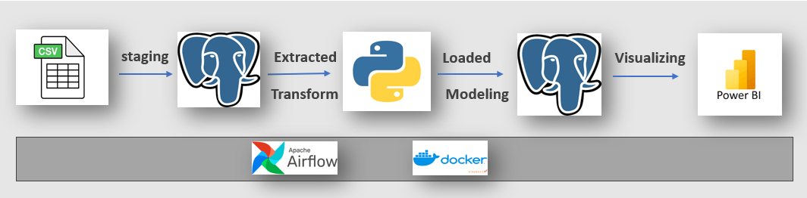
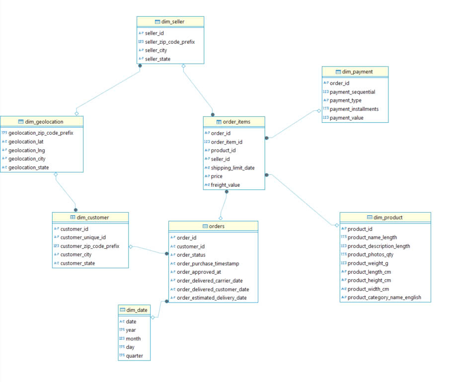
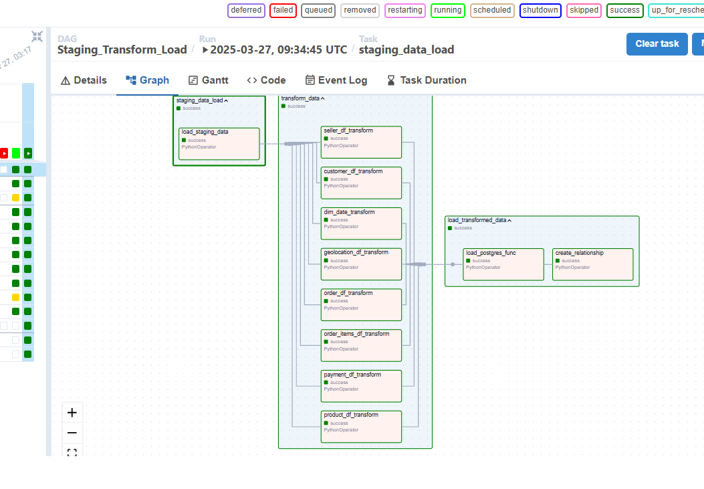

### 1. ***Process*
This project outlines a comprehensive data processing pipeline. Data from a CSV file goes through these main stages:
    1. Storage: The CSV file is imported into a PostgreSQL database
    2. Extraction and Transformation: Data is processed and transformed using Python
    3. Modeling: Transformed data is stored back in PostgreSQL for modeling.
    4. Visualization: Modeled data is visualized through Power BI
 Apache Airflow for workflow management and Docker for containerization. It serves as a classic example of an ETL (Extract, Transform, Load) process that integrates multiple tools for data processing and visualization.

### 3. **DataModel**

### 2. **Output**

